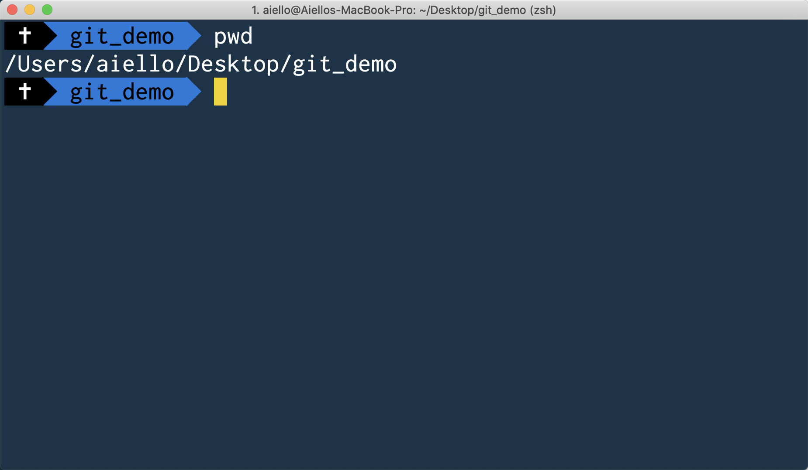
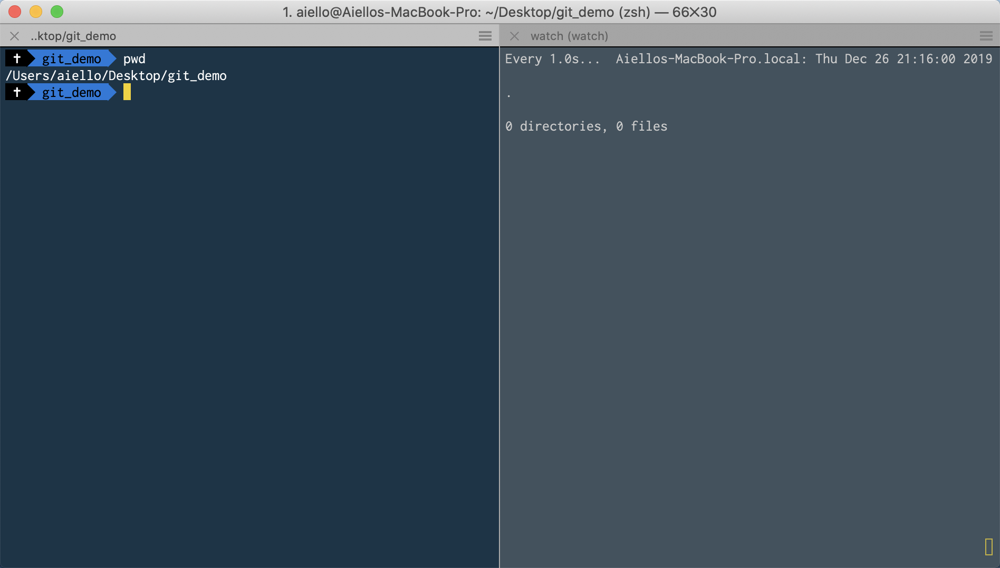
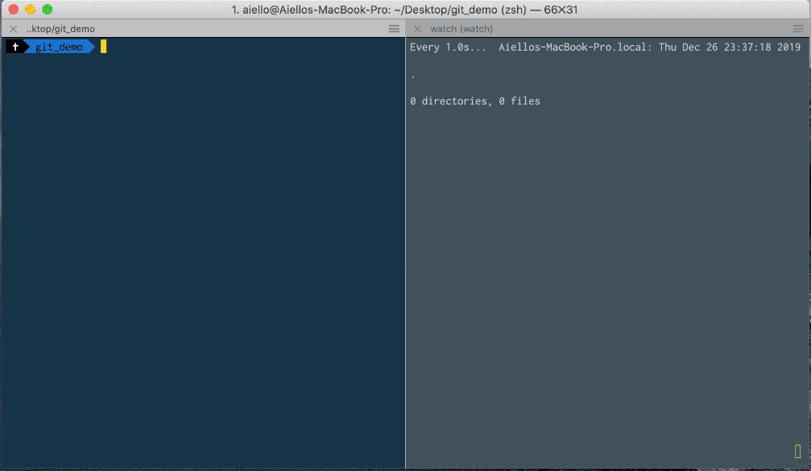
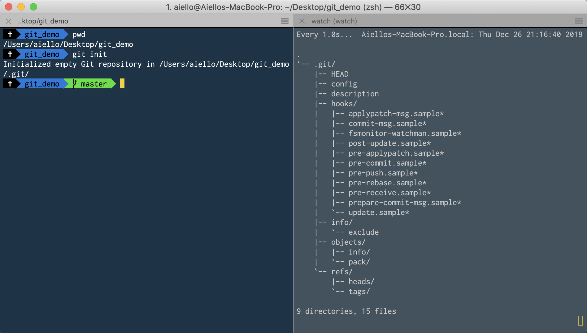
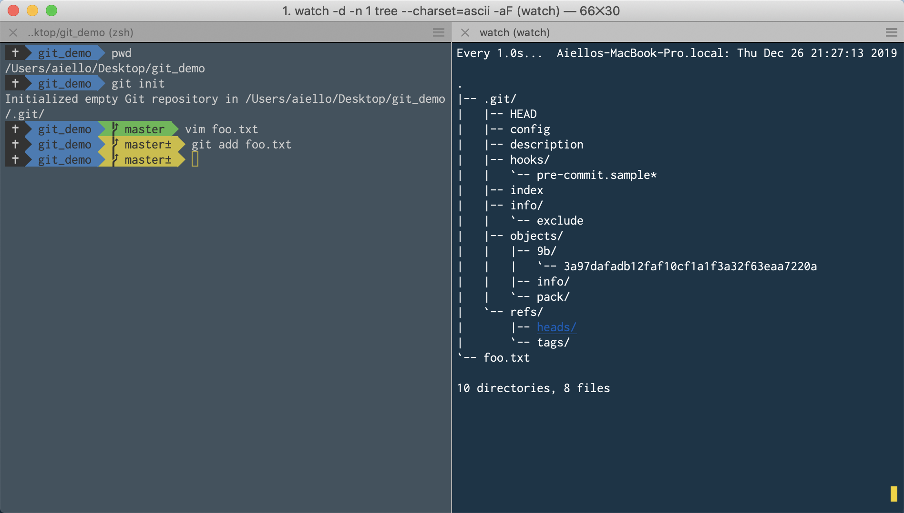
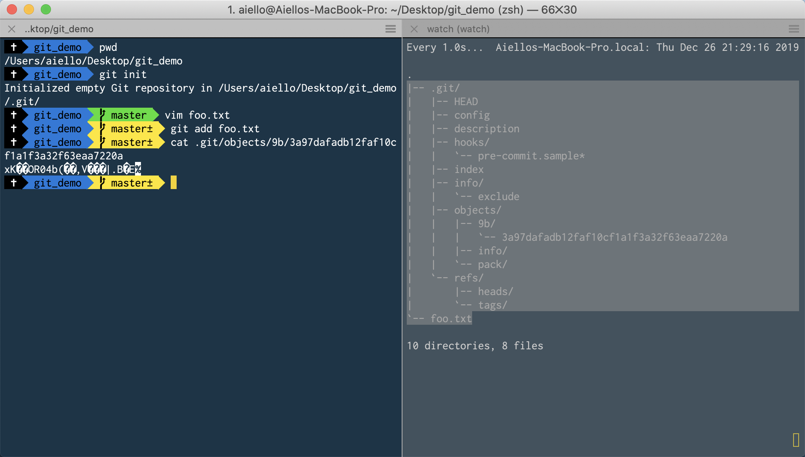
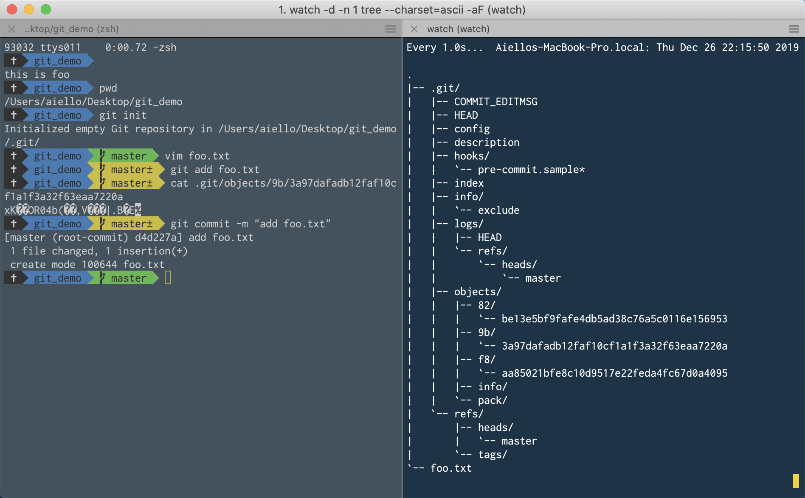
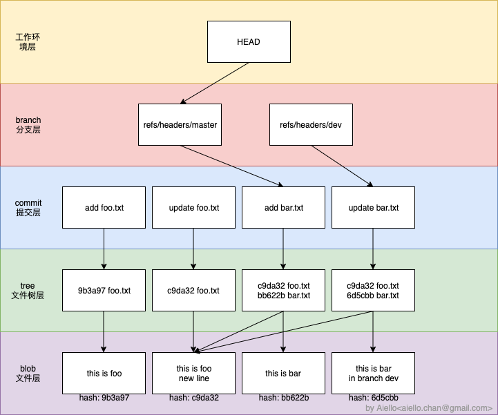

# Git 如何存储数据的.md

Git 使我们每天使用得最多的工具之一，它是 linux 内核的最早作者 Linus Torvalds 创建的全新版本控制工具，和 linux 一样的简单好用，这篇文章就简单地讲一下 git 是如何工作的

## 要求

- 知道 Git
- 摘要算法的作用（MD5、sha-1
- 一些简单的 Linux 命令

## 你将了解

- .git 目录结构
- git 如何存储文件

## Demo 中用到的工具

- VS Code：一款通用编辑器
- iTerm：macOS 上的命令行软件
- watch：类 Unix 上的命令行工具，可以定时重复执行指定命令并输出
- tree：类 Unix 上的命令行工具，可以输出指定目录的目录树结构

## 本地配置

### 1. 在本地安装 Git

https://git-scm.com/ 下载安装即可

### 2. 先在任意位置创建一个空文件夹

我在我的桌面上创建了一个名为 git_demo 的文件夹

### 3. 在命令行中切换到该目录下



### 4. 监控目录变化

我这里是直接拆分窗口，便于显示，并导航到同样的目录


在右侧窗口中，输入以下命令，用来监控目录变化

```shell
watch -d -n 1 tree --charset=ascii -aF
```

该命令综合了两个工具，一个是 `watch` 一个是 `tree`，通过 watch 来定时（上面指定每隔 1 秒）执行一次后面的命令，我们就能够看到实时的目录变化了



补上一个动图版本



## 开始 Demo

### 1. Git init

在左侧命令行中执行熟悉的 `git init`，我们将在当前目录创建一个本地的 git 仓库，执行完后是这样的



在右侧我们可以看到，本地多出了一个名为 `.git` 的隐藏目录，里面有一些文件夹，我们先看第一级

```text
`-- .git/
    |-- HEAD
    |-- config
    |-- description
    |-- hooks/
    |-- info/
    |-- objects/
    `-- refs/
```

其中有这么几个文件/夹

- HEAD 他的内容是

  ```text
  ref: refs/heads/master
  ```
  
  说明现在的引用指向的是 `refs/heads/master` 这个目录，其实也是我们当前工作的位置

- config 其实就是本地的 git config

  ```text
  [core]
    repositoryformatversion = 0
    filemode = true
    bare = false
    logallrefupdates = true
    ignorecase = true
    precomposeunicode = true
  ```

  是一种类 [toml](https://github.com/toml-lang/toml) 的数据格式

- description 就是一个描述，平时用不到

  ```text
  Unnamed repository; edit this file 'description' to name the repository.
  ```

- hooks 这里存放本地的 git hooks

  他的作用就是在你执行一些特定 git 命令（比如 git commit）的时候，顺带执行你指定的 bash 命令，很强大的功能。比如我们想在提交前执行代码测试，我们就可以去编辑 hooks 里面的 `pre-commit.sample` 这个文件，并且去掉文件名末尾的 `.sample`，那在你下次执行 `git commit` 的时候，就会先运行这个 bash，只有当整个 bash 执行成功后（退出码为 0），才会执行你刚才的 `git commit`.
- info 存放一些默认的配置文件

  默认的已经存放了一个名为 `exclude` 的文件，其实就是一个 `.gitignore` 文件

- objects 这里真实地存放着我们代码的备份，一会儿会详细说明的
- refs 这个也是非常关键的一个文件夹，存放着我们所有的分支信息

这个文件夹内，最重要的就是 `HEAD` 文件，`objects` 文件夹，`refs` 文件夹，git 通过先访问 `HEAD` 文件，找到我们当前工作的分支，然后再去 `refs` 文件夹中找到对应的分支描述，这个描述文件正是指向了 `objects` 文件夹内的某一个文件，再通过这个文件，我们就能得到当前分支当前版本的所有源码了！

上面看了，`HEAD` 文件其实就只有一行，指向了 `refs` 目录的一个文件

我们就来探秘一下 `refs` 文件夹和 `objects` 文件夹到底是在做什么

### 2. 新建一个文件

*为了避免过多的文件影响，我们先将 hooks 文件夹里的文件都删掉，只保留 pre-commit.sample*

现在我们在 `git_demo` 目录下新建一个文件名为 `foo.txt`，并且在里面输入以下数据并保存（注意下面的文本结尾没有空格，没有换行）

```text
this is foo
```

再查看我们的目录结构

```text
|-- .git/
|   |-- HEAD
|   |-- config
|   |-- description
|   |-- hooks/
|   |   `-- pre-commit.sample*
|   |-- info/
|   |   `-- exclude
|   |-- objects/
|   |   |-- info/
|   |   `-- pack/
|   `-- refs/
|       |-- heads/
|       `-- tags/
`-- foo.txt
```

如期地多出了一个 `foo.txt` 文件

### 3. 将文件添加进缓存区

其实就是我们无比熟悉的 `git add` 命令了，我们在左侧命令行执行 `git add foo.txt`，可以看到目录树是这样



```text
|-- .git/
|   |-- HEAD
|   |-- config
|   |-- description
|   |-- hooks/
|   |   `-- pre-commit.sample*
|   |-- index
|   |-- info/
|   |   `-- exclude
|   |-- objects/
|   |   |-- 9b/
|   |   |   `-- 3a97dafadb12faf10cf1a1f3a32f63eaa7220a
|   |   |-- info/
|   |   `-- pack/
|   `-- refs/
|       |-- heads/
|       `-- tags/
`-- foo.txt
```

在 `objects` 文件夹中，多出了一个名为 `9b` 的文件夹，并且里面有一个名为 `3a97dafadb12faf10cf1a1f3a32f63eaa7220a` 的文件，我们看看这个文件是什么呢



看起来是个二进制文件，其实这个就是我们的源码了😂，只是被压缩处理了
>git 对每次添加进缓存区的文件，都会执行一次 defete 压缩然后存储

我们执行一下这个命令，这个命令的功能是将 `blob 12\0this is foo` 这个字符串，用 openssl 中的 sha1 算法计算摘要

```bash
echo "blob 12\0this is foo" | openssl sha1
```

发现了什么，生成的摘要结果（9b3a97dafadb12faf10cf1a1f3a32f63eaa7220a）和我们目录（9b）以及文件名（3a97dafadb12faf10cf1a1f3a32f63eaa7220a）加起来的字符串一样

>git 会将文件以 `blob 文件长度（单位B）\0文件内容` 进行计算 sha1，将得到的结果，前两位作为文件夹名称，剩下的部分作为文件名，将我们的文件存储在 `objects` 目录下

好了，我们基本知道了，git 是如何存储我们的文件了，那我们提交一次代码，看会有什么变化

### 4. git 内置二进制查看工具

我们也可以使用 git 内置的一个查看命令，来查看对应的提交文件

```bash
# 查看 object 的类型
> git cat-file -t 9b3a97dafadb12faf10cf1a1f3a32f63eaa7220a
blob
# 查看 object 的类型，后面的提交 hash 其实可以简写前面一部分，只要保证只能检索出一个文件即可
> git cat-file -t 9b3a
blob
# 查看 object 的内容
> git cat-file -p 9b3a
this is foo
```

### 5. 进行一次 commit

很常规，我们就执行 `git commit -m "add foo.txt"` 这个命令进行提交就好了，结果如下



```text
|-- .git/
|   |-- COMMIT_EDITMSG
|   |-- HEAD
|   |-- config
|   |-- description
|   |-- hooks/
|   |   `-- pre-commit.sample*
|   |-- index
|   |-- info/
|   |   `-- exclude
|   |-- logs/
|   |   |-- HEAD
|   |   `-- refs/
|   |       `-- heads/
|   |           `-- master
|   |-- objects/
|   |   |-- 82/
|   |   |   `-- be13e5bf9fafe4db5ad38c76a5c0116e156953
|   |   |-- 9b/
|   |   |   `-- 3a97dafadb12faf10cf1a1f3a32f63eaa7220a
|   |   |-- f8/
|   |   |   `-- aa85021bfe8c10d9517e22feda4fc67d0a4095
|   |   |-- info/
|   |   `-- pack/
|   `-- refs/
|       |-- heads/
|       |   `-- master
|       `-- tags/
`-- foo.txt
```

文件夹瞬间多了几个文件，objects 目录中多出了两个文件夹 `82`、`f8` 以及相应的文件，`refs` 文件夹中则是多出了一个名为 `master` 的文件，他就是指向我们当前的分支啦

查看一下 `refs/headers/master` 文件里面内容是什么

```bash
> cat .git/refs/heads/master
82be13e5bf9fafe4db5ad38c76a5c0116e156953
```

是一个 hash，根据这个hash，我们能够在 `objects` 中找到对应的文件了，使用 `git cat-file` 查看一下

```bash
> git cat-file -t 82be13e5bf9fafe4db5ad38c76a5c0116e156953
commit
> git cat-file -p 82be13e5bf9fafe4db5ad38c76a5c0116e156953
tree f8aa85021bfe8c10d9517e22feda4fc67d0a4095
author Aiello <aiello.chan@gmail.com> 1577369635 +0800
committer Aiello <aiello.chan@gmail.com> 1577369635 +0800

add foo.txt
```

说明这个文件是一个 `commit` 类型的文件，文件内容则是指向了一个类型为 `tree` 的文件，我们继续顺藤摸瓜，去找这个 `tree` 类型的文件包含了什么信息

```bash
> git cat-file -t f8aa85021bfe8c10d9517e22feda4fc67d0a4095
tree
> git cat-file -p f8aa85021bfe8c10d9517e22feda4fc67d0a4095
100644 blob 9b3a97dafadb12faf10cf1a1f3a32f63eaa7220a foo.txt
```

可以看到，这个 `tree` 类型的文件，指向了我们的源文件，我们通过之前相同的方法进行一次 hash 计算试试

```bash
# 获取提交的类型
> git cat-file -t f8aa85021bfe8c10d9517e22feda4fc67d0a4095
tree
# 获取文件内容
> git cat-file tree f8aa85021bfe8c10d9517e22feda4fc67d0a4095
100644 foo.txt�:������
                      ��/c�
# 计算内容的字节数
> git cat-file tree f8aa85021bfe8c10d9517e22feda4fc67d0a4095 | wc -c
35
# 合起来计算
# 按照 类型 字节数\0内容 的公式计算
> (printf "tree %s\0" $(git cat-file tree f8aa85021bfe8c10d9517e22feda4fc67d0a4095 | wc -c); git cat-file tree f8aa85021bfe8c10d9517e22feda4fc67d0a4095) | openssl sha1
f8aa85021bfe8c10d9517e22feda4fc67d0a4095
```

会发现，和我们输入的 hash 值一样！
那我们用同样的方法手动计算一下 commit 的 hash 值呢：

```bash
> (printf "commit %s\0" $(git cat-file commit 82be13e5bf9fafe4db5ad38c76a5c0116e156953 | wc -c); git cat-file commit 82be13e5bf9fafe4db5ad38c76a5c0116e156953) | openssl sha1
82be13e5bf9fafe4db5ad38c76a5c0116e156953
```

和预期一样，输出了我们在目录树中看到的 hash 值，所以，在 git 中，始终使用了这套计算公式来计算 hash:

>类型 字节数\0内容

### 6. 修改当前文件并提交

我们修改一下当前的文件，并提交

```bash
> cat foo.txt
this is foo
and new line
```

执行 `git add` 后，我们的目录树变成了这样

```text
|-- .git/
|   |-- COMMIT_EDITMSG
|   |-- HEAD
|   |-- config
|   |-- description
|   |-- hooks/
|   |   `-- pre-commit.sample*
|   |-- index
|   |-- info/
|   |   `-- exclude
|   |-- logs/
|   |   |-- HEAD
|   |   `-- refs/
|   |       `-- heads/
|   |           `-- master
|   |-- objects/
|   |   |-- 82/
|   |   |   `-- be13e5bf9fafe4db5ad38c76a5c0116e156953
|   |   |-- 9b/
|   |   |   `-- 3a97dafadb12faf10cf1a1f3a32f63eaa7220a
|   |   |-- c9/
|   |   |   `-- da32f4e76824497d02312e46ac0a40e28bef91
|   |   |-- f8/
|   |   |   `-- aa85021bfe8c10d9517e22feda4fc67d0a4095
|   |   |-- info/
|   |   `-- pack/
|   `-- refs/
|       |-- heads/
|       |   `-- master
|       `-- tags/
`-- foo.txt
```

多出了一个名为 `c9` 的文件夹，以及相关文件，其实我们用 `git cat-file` 就可以看到，这个就是我们当前的文件

```bash
> git cat-file -p c9da32f4e768
this is foo
and new line
```

这说明，git 根据我们的最新文件，又创建了一个新的压缩记录。**这个压缩文件中是全量的 foo.txt**，就算删掉之前的 `9b3a97dafadb12faf10cf1a1f3a32f63eaa7220a` 文件，对当前的文件也是没有任何影响的，我们依然能够获得最新版的全量文件！只是删除以前的记录后，回滚就会出现问题。

接着我们提交这个改动

```bash
> git commit -m "update foo.txt"
[master 432a5d9] update foo.txt
 1 file changed, 1 insertion(+)
```

然后看我们的目录树

```text
|-- .git/
|   |-- COMMIT_EDITMSG
|   |-- HEAD
|   |-- config
|   |-- description
|   |-- hooks/
|   |   `-- pre-commit.sample*
|   |-- index
|   |-- info/
|   |   `-- exclude
|   |-- logs/
|   |   |-- HEAD
|   |   `-- refs/
|   |       `-- heads/
|   |           `-- master
|   |-- objects/
|   |   |-- 03/
|   |   |   `-- 7b10984589cbfe8c6a9c5b84d61592f84fd97a
|   |   |-- 43/
|   |   |   `-- 2a5d918414362c78da50274a1fa0c57b5dc380
|   |   |-- 82/
|   |   |   `-- be13e5bf9fafe4db5ad38c76a5c0116e156953
|   |   |-- 9b/
|   |   |   `-- 3a97dafadb12faf10cf1a1f3a32f63eaa7220a
|   |   |-- c9/
|   |   |   `-- da32f4e76824497d02312e46ac0a40e28bef91
|   |   |-- f8/
|   |   |   `-- aa85021bfe8c10d9517e22feda4fc67d0a4095
|   |   |-- info/
|   |   `-- pack/
|   `-- refs/
|       |-- heads/
|       |   `-- master
|       `-- tags/
`-- foo.txt
```

和预期的一样，生成了 `43` 和 `03` 文件夹，分别存放了这次的 `commit` 记录和 `tree` 记录

```bash
> git cat-file -t 432a
commit
> git cat-file -t 037b
tree
```

### 7. 提前总结

根据上面的一些操作，我们对 git 的整套存储机制已经有了非常清晰的了解，我们可以大胆的画出下面这个模型图




*注意：图中我并没有写出每个文件的hash，但是要知道，每个层中的每个文件都有唯一的一个 hash 作为文件名，所以永远不会存在两个内容相同的文件（就算你的commit信息一样，但是其所对应的 tree 和 blob 的 hash 都会是不同的）！*

> git 中每一级都是很清晰的分层，各司其职，然后通过 hash 把他们链接起来！

从图中我们可以看到，当前我们所在的 HEAD 是指向的 `master` 分支，而 `master` 分支又指向某一个指定的提交记录 `add bar.txt`，该提交记录又指向提交时的一个文件目录树，这个树则继续指向了当时的文件！

这种存储方式清晰，可靠，扩展性强，在真实文件层，同样内容的文件，只会存储一份（因为 blob hash 的计算只和文件内容相关，所以一个文件修改后提交，会增加一个新的 blob，如果将其修改回来，再提交，并不会创建新的 blob，而是复用之前的，因为他们的内容都是一模一样的，就算文件名不同，但内容完全相同的文件，也会只存储一份！）

### 8. 分支切换

其实通过图中可以看到，新建或者切换分支，我们要做的仅仅是新建一个 branch 文件，然后将该文件指向我们指定的 commit 即可，就是这么简单可靠。

至于 git 的回滚、rebase、merge 等等操作，现在看起来就清晰很多了吧

### 9. 打包送的 hooks

文章开头写的，hooks 可以帮我们做很多事情，我们之前还留有一个叫 `pre-commit.sample` hooks 没有删除，我们就将其拿来用一下

(因为该文件中有一些示例，如果你不想清空，那就复制一份该文件，并将其末尾的 .sample 去掉)

```bash
> copy .git/hooks/pre-commit.sample .git/hooks/pre-commit
```

编辑 `.git/hooks/pre-commit` 文件，将其清空，并输入下面的代码

```bash
#!/bin/sh
echo "this is pre-commit hooks"
```

则你在下一次提交的时候，控制台会打印出上面的文字，在这里面，可以写上一些 lint 的代码，如果 lint 通过，则允许提交，然后在 `pre-push` 这个 hooks 中运行本地测试，通过才允许提交到服务端，等等（之前在做组件库的时候，我们还用 hooks 自增小版本，哈哈哈，非常方便，也不会有小版本失控的情况，因为更新中版本的时候，会手动重置小版本

现在已经有很多库能够帮助你执行 hooks 了，如 [husky](https://github.com/typicode/husky)

🎉
