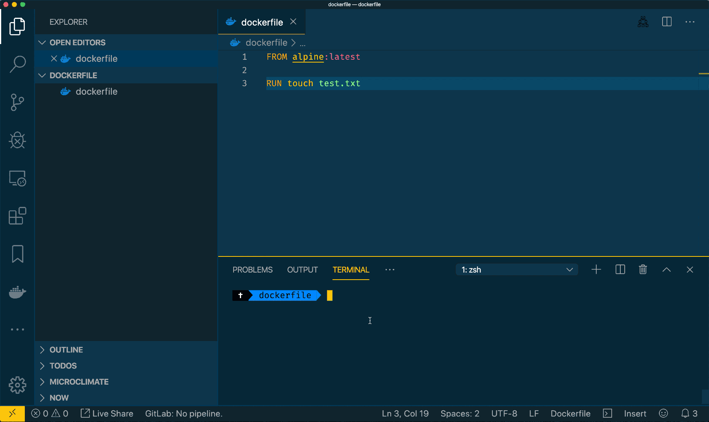

# 实现 Docker run dockerfile

因为最近要使用 dockerfile 构建镜像，想到每次都 build 然后 run 然后删除就恶心，所以，做了这个脚本，主要功能就是直接 run dockerfile

主要是自己使用，满足自己的需求，如果你有更多的需求，这个可以作为一个参考，来编写你自己的脚本使用😎

```bash
#!/bin/bash

DOCKERRUN_UUID="dockerrun_temp_image"

DOCKERFILE=$1
if [ -f $DOCKERFILE ]
then
  echo -ne "Use dockerfile: "$DOCKERFILE
else
  echo -ne "No dockerfile found"
  exit 1
fi

echo -ne "\r\033[Kbuilding..."
docker build -t $DOCKERRUN_UUID - < $DOCKERFILE  > /dev/null
docker run -it --rm $DOCKERRUN_UUID /bin/sh
echo -ne "\r\033[Kcleaning..."
docker rmi $DOCKERRUN_UUID > /dev/null
echo -ne "\r"
```

自动清除构建的 image 和运行中的容器


